# MLB Bet Spot-Check Session

**Aug 25–26, 2026** · Reviewing multi-agent betting system output against source data

---

## Contents

- [Aug 25 — Zac Thornton](#aug-25--zac-thornton-under-155-outs)
- [Aug 25 — Jacob deGrom](#aug-25--jacob-degrom-under-165-outs)
- [Aug 26 — Slate review](#aug-26--five-pick-slate)
- [Aug 26 — MacKenzie Gore](#aug-26--mackenzie-gore-strikeouts)
- [Aug 26 — Randy Dobnak](#aug-26--randy-dobnak-under-165-outs)
- [Aug 26 — Dodgers / Braves](#aug-26--dodgers--braves)
- [Aug 26 — Red Sox / Marlins](#aug-26--red-sox--marlins)
- [Aug 26 — Cubs / Diamondbacks](#aug-26--cubs--diamondbacks)
- [Aug 26 — Landen Roupp](#aug-26--landen-roupp-under-175-outs)
- [Final card](#final-card)
- [Recurring findings](#recurring-findings)

---

## Aug 25 — Zac Thornton under 15.5 outs

**Andy:** ok we are evaluating MLB bets. I get suggestions from a system I made, we are spot-checking them. how do we feel about zac thornton going under 15.5 outs tonight? informative graphs attached.

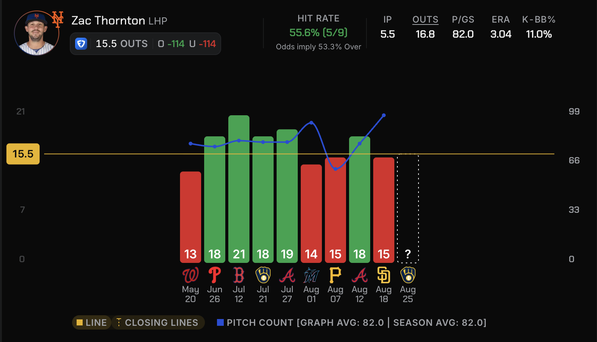
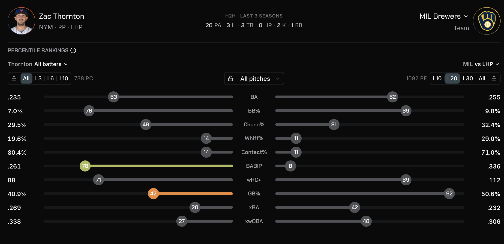
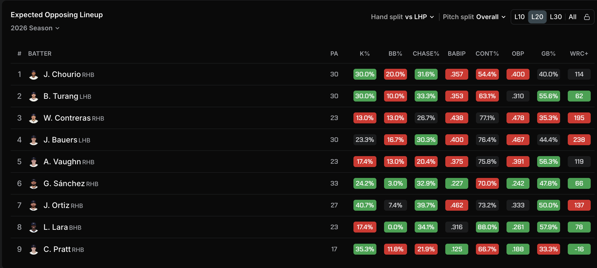
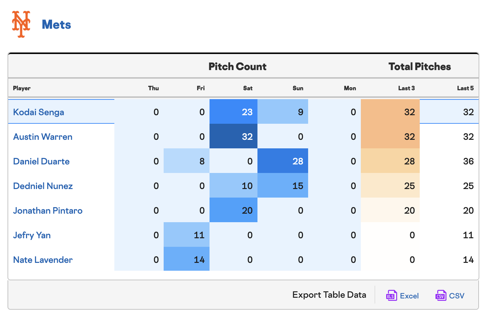

**Claude:** Lean under, but thin — a small play, not a confident one.

**The base rate argues against you.** Outs by start: 13, 14, 15, 15, 18, 18, 18, 19, 21. Median 18, mean 16.8, both above the line. Under hits 4/9 (44%) vs. a 53.3% breakeven at -114.

**The mechanism is pitch efficiency, and his distribution is bimodal.** Capped around 82 pitches (graph avg = season avg = 82.0 — that's a leash, not a coincidence). Under ~4.5 pitches/out he goes 18–21; at 6+ he lands at 14–15. Almost nothing at 16–17. This is a binary bet on whether he gets through the 6th, and the input is walks/deep counts.

**The matchup helps.** Brewers vs LHP L20: 9.8% BB, 29.0% whiff. Top five (Chourio 20% BB, Bauers 16.7%, Contreras 13%, Vaughn 13%) grinds counts. Against an 82-pitch ceiling, one 25-pitch inning ends the outing.

**Two things the graphs don't show:**

- Rookie who debuted May 20, coming off a 2025 that ended in June with an oblique injury. Around 87 IP across levels. Mets are 59-72 and out of it. Late-August workload management is a real under tailwind.
- Peripherals say the 3.04 ERA is fiction — .269 xBA vs .235 BA, .338 xwOBA, .261 BABIP, 14th percentile whiff *and* contact-allowed.

**Against:** Citi Field, and the bottom of that lineup is bad (Sánchez 66 wRC+, Lara 78, Pratt −16, Ortiz 40.7% K). Also those Brewers L20 splits are 17–33 PA per hitter with .400+ BABIPs.

**54–57% under. Playable at -114, no more.**

One question: the card shows 55.6% hit rate on the *over*. If it flagged this as an under, it's overriding the base rate with matchup adjustment — worth checking whether that adjustment leans on the L20 opponent splits, because those samples are too small to carry that weight.

---

**Andy:** bot logic:

> **Quant 7/10** — Thornton's xERA near 4.85 is wildly unsustainable versus sub-3 ERA, Brewers rank 1st vs LHP and 2nd in pitches per PA creating a fast count environment, and Mets have zero playoff incentive to extend a young arm past 80 pitches — 15.5 outs (5.2 IP) is a reasonable cap.
>
> **Cynic 7/10** — Mets have nothing to play for so they'll yank Thornton early, Brewers are the toughest lineup vs. LHP in baseball and rank 1st or 2nd in pitches per plate appearance — that combination limits outs in a very mechanical, repeatable way at a reasonable price.
>
> **Careful 7/10** — Two angles converge cleanly: Mets have no incentive to overextend Thornton past ~80 pitches, and Milwaukee ranks 1st vs LHP/2nd in P/PA, a formula that drains pitch count before outs accumulate.

**Claude:** Two of the three load-bearing claims don't hold up.

**"Brewers rank 1st vs LHP" — likely backwards.** As of end of May, Milwaukee sat in the 80–90 wRC+ cluster against lefties alongside Pittsburgh, the Athletics, and Baltimore, and had the second-largest RHP-over-LHP gain in the league at +27.2. The best mark vs LHP belonged to the Yankees at 123. The 112 wRC+ on your screenshot is an **L20 window**, not a season rank.

**"2nd in P/PA" conflicts with your own input.** Image 2 has Milwaukee at 32.4% chase vs LHP. High-chase teams don't usually rank near the top in pitches per PA.

**"15.5 outs (5.2 IP)" is a unit error.** In baseball notation 5.2 IP is 17 outs. 15 outs is 5.0 IP flat.

**The workload argument may be inverted.** All three treat "won't extend him past 80 pitches" as an under angle. But he averages 82 P/GS at ~4.9 pitches per out. A pitcher at 75–78 after five comes out for the sixth and gets pulled after one or two outs — that's 16–17 outs and the over cashes.

**The xERA pillar survives.** ~4.85 against 3.04 is consistent with the .269 xBA and .338 xwOBA.

**Systems note:** Quant, Cynic, and Careful returned identical 7/10s citing the same two facts. That's one argument with three votes.

---

**Andy:** 5.2 innings = five innings + 2 outs

**Claude:** Right — and that's my point: 5.2 IP is 17 outs, so it can't be the notation for a 15.5-out line.

But I overstated its significance. The bot almost certainly computed 15.5/3 = 5.17 and wrote it as a decimal, which is arithmetically fine. The collision with baseball notation is a display bug, not evidence the agents were reasoning about the wrong number. I claimed it meant they were working with a cap "two outs more generous than the real one" — I don't have support for that. Retracting it.

The substantive version doesn't depend on the notation: an 82-pitch leash produces mid-inning hooks, not clean five-inning exits.

---

**Andy:** ah ok good catch. i will check this out.

**Claude:** If the season-long numbers come back closer to that 80–90 wRC+ cluster than to "1st in baseball," the whole 7/10 consensus is resting on a rolling window, and I'd want to know whether that window-vs-season mix-up is specific to this pick or systematic.

---

## Aug 25 — Jacob deGrom under 16.5 outs

**Andy:** lets try this

> **4. Jacob deGrom outs under 16.5 +104** — Texas Rangers @ Chicago White Sox
> **Quant 7/10** — deGrom went under 16.5 outs in 6 of last 7 starts and faced this same White Sox lineup in only 4.2 IP on 94 pitches; Chicago's 6th-ranked walk rate inflates pitch counts...
> **Cynic 7/10** — ...couldn't get through 5 innings against this exact White Sox lineup on 94 pitches — the historical precedent is specific and strong... -123 is a bit steep but the trend is hard to argue with.
> **Careful 7/10** — Two clean angles... LIKE 0.6u $30.00

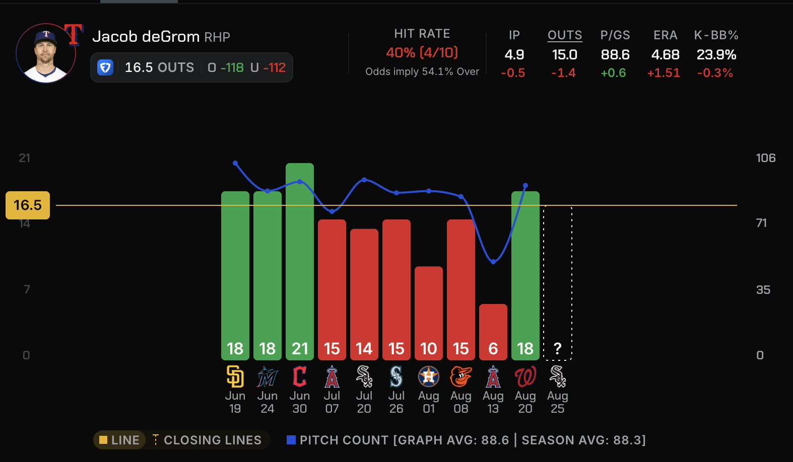
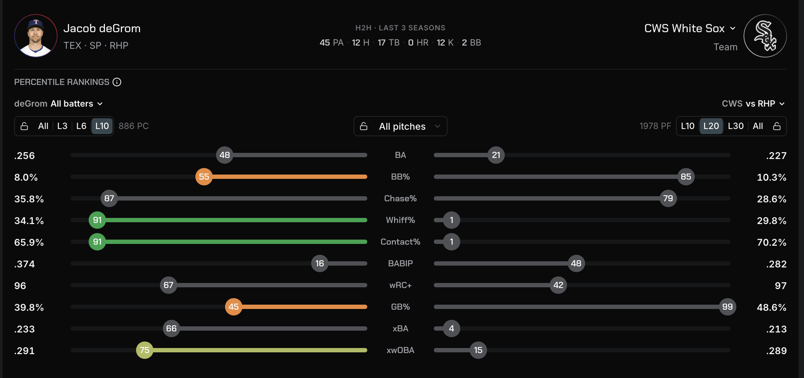
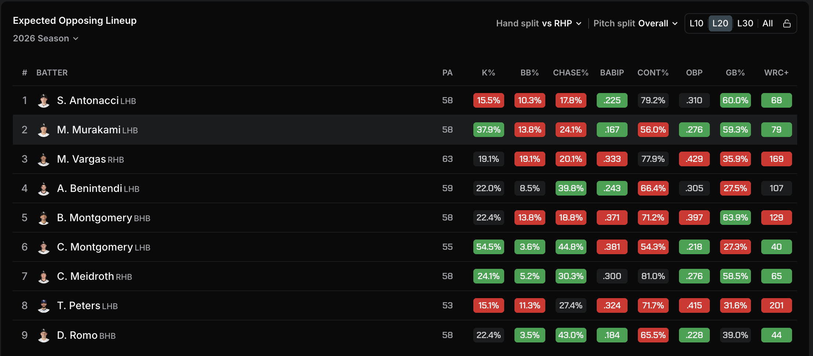
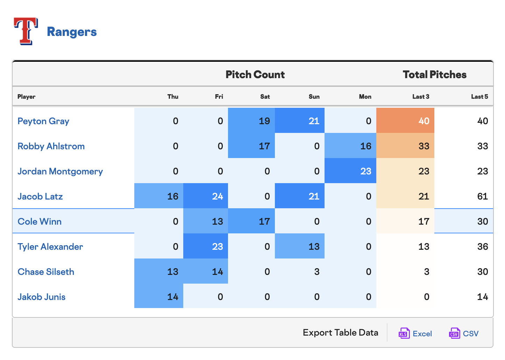

**Claude:** The factual claims check out — but the case is built on the wrong side of the data.

**Accurate:** 6-of-7 unders is right. July 20 CWS start was 14 outs = 4⅔ IP at ~94 pitches. Chicago's 10.3% BB vs RHP is 85th percentile.

**Where it goes wrong:**

**deGrom's stuff is elite and the ERA is the noise.** 91st percentile whiff, 91st percentile contact suppression, 87th chase, .233 xBA vs .256 actual, .291 xwOBA, 23.9% K-BB — and a **.374 BABIP at the 16th percentile**. Quant explicitly waves this off: "regardless of deGrom's stuff quality."

**The trend is contaminated.** Aug 13 was 6 outs on ~50 pitches. And the one over in that stretch is **his most recent start** — Aug 20, 18 outs on ~91 pitches.

**The White Sox are a get-well matchup.** Team xBA .213 is 4th percentile, xwOBA .289 is 15th. The walk rate is concentrated in the top five — the bottom third is 3.6%, 5.2%, and 3.5% BB with high chase.

**The bullpen table argues over and nobody read it.** Ahlstrom and Montgomery both threw Monday. Gray went back-to-back for 40, Latz has 61 across three appearances in five days. A taxed pen means a longer leash.

**The price is inconsistent three ways.** Header +104, Cynic argues -123, screenshot U -112.

**Systems pattern:** two picks, same two failure modes — rolling-window opponent splits described as season league ranks, and zero use of expected metrics on either the pitcher or the offense.

---

**Andy:** another capper says: "Under in 6 of last 7 starts; previously faced White Sox and only made it 4⅔ innings on ~94 pitches; White Sox rank 6th in walk percentage and deGrom's road ERA is 5.00 with higher walk rate."

**Claude:** Same three claims plus one new one, and the new one is the weakest.

**Road ERA 5.00.** Partial-season road splits — five or six games — where one bad inning swings the number by more than a run. And it's ERA, the same outcome stat the .374 BABIP already tells you is disconnected from process. Also: a road ERA argument applied to an **outs** prop. Runs allowed only shortens a start if they come with traffic and pitches.

**Two independent sources converging usually means confirmation.** Here it more likely means both are reading off the same public narrative.

---

**Andy:** the bots are following the cappers to be clear, this isn't coincidence

**Claude:** Then my last point was wrong. Scratch it.

**The "correlated agents" critique needs restating.** If all three are summarizing the same capper input, the convergence carries no information — it's three paraphrases of one source. Stop treating agent agreement as a confidence signal.

**The verification gap is the real finding.** The Brewers claim probably came in from a capper rather than a bug in your feature code. Better news about your pipeline, worse about your inputs: the bot passes through factual claims without checking them against data it already has.

**The harder question is what the bot contributes.** If it ingests capper reasoning and re-scores it, the ceiling is the cappers' edge — and capper takes are public and in the price by first pitch.

Two things that would make it additive: a verification pass that flags any ingested claim contradicted by your feature store, and a disagreement score measuring how far the bot's conclusion sits from the capper input it read.

---

**Andy:** the data is real though, he was under 6 straight games (the 8/13 game is real, not injury) before pitching a gem on 8/20

**Claude:** You're right, and the injury guess was mine to begin with — nothing in the data suggested it. I reached for an explanation that let me discount an inconvenient data point.

**I also need to correct a number.** I said the line "sits right at his season outs average of 16.4." His average is **15.0** — the OUTS figure in the header, and the bars confirm it (150 outs / 10). I don't know where 16.4 came from.

That was load-bearing for my over lean. Sorted: 6, 10, 14, 15, 15, 15, 15, 18, 18, 21 — median 15, under cashes 7 of 10. He's at 5.9 pitches per out; reaching 17 outs inside ~89 pitches requires 5.2, which he's managed in four starts.

**So the under is defensible, and more defensible than I made it sound.** The peripherals are why the book set 16.5 rather than 15.5 — that's a modest edge, not the 70% the raw log implies.

---

**Andy:** the white sox are hitting better than the nats, right?

**Claude:** Other way around, based on what I could pull.

Washington has scored 682 runs against 672 allowed, a 67-65 Pythagorean record — about 5.2 runs per game through ~132 games. Their park is playing as a hitters' park (105 one-year batting factor), but that's not most of it.

Chicago, from your screenshot: 4th-percentile xBA (.213), 15th-percentile xwOBA (.289), 97 wRC+.

**Implication cuts against the under.** The Aug 20 gem came against the *better* offense of the two, and now he draws the weaker one.
---

## Aug 26 — Five-pick slate

**Andy:** new day, new bets: lmk how you feel about these

> **1. MacKenzie Gore k over 6.5 +141** — TEX @ CWS — Quant/Cynic/Careful all 9/10 — changeup 42.4% K-rate, curve 31.7% whiff, White Sox lead MLB in August strikeouts — **LOCK 1.2u $60**
> **2. Over 8.5 -120** — CHC @ ARI — 9/8/8 — Boyd 4-seam .397 xwOBA, E-Rod cutter .368, both lineups top-2 vs LHP, Chase Field — **LOCK 0.9u $45**
> **3. Dodgers -1.5 +124** — LAD @ ATL — 9/8/8 — Sasaki vs rookie with 6 ER in 8.2 IP, #1 bullpen — **LIKE 0.6u $30**
> **4. Red Sox -1.5 +123** — BOS @ MIA — 8/8/8 — Gray 16-3, 2.79 ERA, sweeper .199 xwOBA, Gusto can't go deep — **LIKE 0.6u $30**
> **5. Randy Dobnak outs under 16.5 -120** — KC @ TOR — 8/7/6 — 7.7% sinker whiff, 3rd-percentile K%, 10% August walk rate — **LEAN 0.2u $10**

**Claude:** Two structural problems first.

**The price mismatch is a persistent bug.** Pick 1 header +141, Quant evaluates "+120." Pick 2 header -120, Quant "-108." Pick 4 header +123, Quant "+104." Same thing as deGrom yesterday. Every EV claim is computed against the wrong price.

**The consensus loop is explicit in the text.** Pick 1 Careful: "three analysts converge including a LOCK call." Pick 3 Careful: "moving up one notch conceding Quant and Cynic are right." That's the loop closing.

Pick 2's Cynic is the exception and the best line in the document: agreement is noise, the underlying pitch data is real.

**Sizing is inverted relative to information.** The two picks with pure circular consensus got 1.2u and 0.9u. The one with genuine disagreement — Dobnak at 8/7/6 — got 0.2u.

**1. Gore K over 6.5.** The thesis rests on his changeup at 42.4% K-rate. But at the time of the trade he was described as throwing at least 80% fastball/slider to lefties and 80% fastball/curveball to righties, with "developing a fourth pitch shape" flagged as the key need. Either low usage or tiny sample. Also his 2026 is worse: ERA up from 4.17 to 4.80, FIP 3.74 to 3.82. And "MLB-leading August strikeouts" is almost certainly overall, not vs LHP.

**2. Over 8.5.** "Both lineups rank top-2 vs LHP" is the exact claim type that was wrong about Milwaukee. "Chase Field elevation" is a Coors argument misapplied — Chase is ~1,100 feet with a humidor since 2018.

**3 and 4 are the same bet twice.** Both -1.5 road runlines justified entirely by starting pitcher quality and bullpen rank. Neither mentions a single offense. A -1.5 cover is mostly a question of run production.

**5. Dobnak.** Careful's own reasoning argues against the pick — a contact pitcher generating weak contact is efficient, and efficiency lets a starter go deep.

---

**Andy:** it feels like you are giving me a structurally cynical response to these bets. concerns understood but like saying no to everything is safe and not very helpful... gore data attached, let's start there

---

## Aug 26 — MacKenzie Gore strikeouts

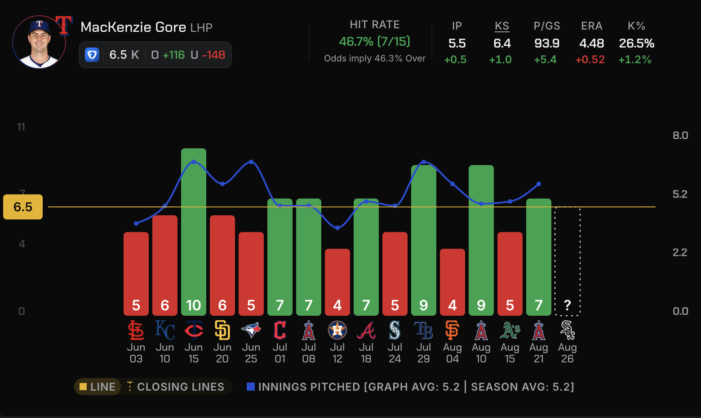
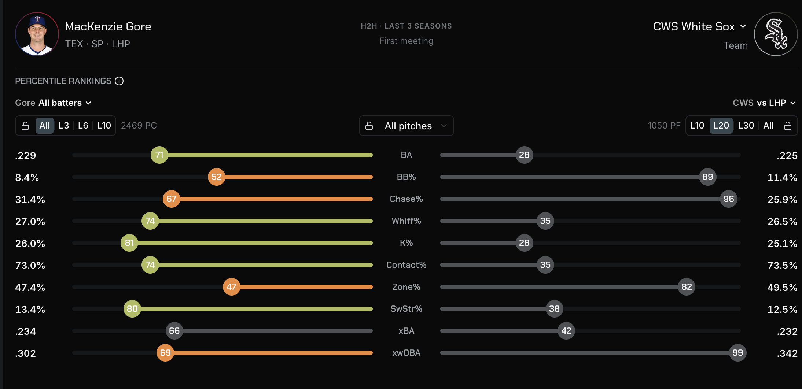
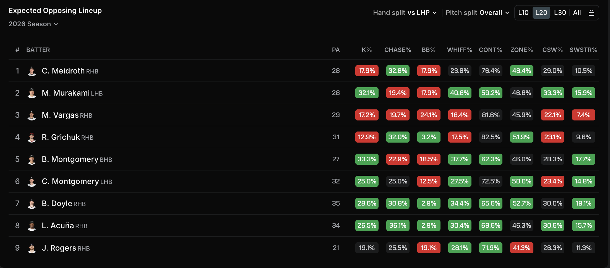

**Claude:** Fair hit. Concrete, with a number.

**The bot's direction is right; its evidence was wrong.** Gore is a legitimate strikeout pitcher — 81st percentile K%, 80th SwStr%, 74th whiff, 26.5% K rate. That holds without the changeup story. And the vs-LHP lineup is more strikeout-prone: five of nine at 25%+ K, team K% 25.1%.

**The math is tighter than 9/10 implies.** Average 6.4 K on 24 batters faced. To get 7 he needs ~26–27 BF — six innings instead of his usual 5.2. He's done it 7 of 15 times. And the top three walk at 17.9%, 17.9%, 24.1%; chase is 25.9% at the **96th percentile**. He's already at 93.9 pitches for 5.2 innings.

Meidroth (17.9% K, 76.4% contact), Vargas (17.2%, 81.6%), and Grichuk (12.9%, 82.5%) are three of the top four and hard to strike out.

**Base rate 46.7% (7/15). Breakeven at +116 is 46.3%.** True coin flip; shade slightly under on innings risk. 44–47%.

**But the price is the whole bet, and you have three of them.** Header +141, Quant +120, screenshot +116. At +116 roughly fair. **At +141 a clear play.** Unresolvable from the inputs — the single most fixable thing in the pipeline.

---

## Aug 26 — Randy Dobnak under 16.5 outs

**Andy:** here's the dobnak info

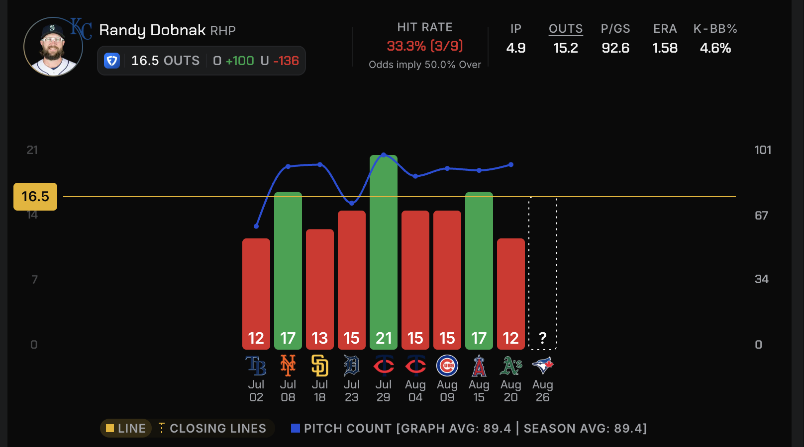
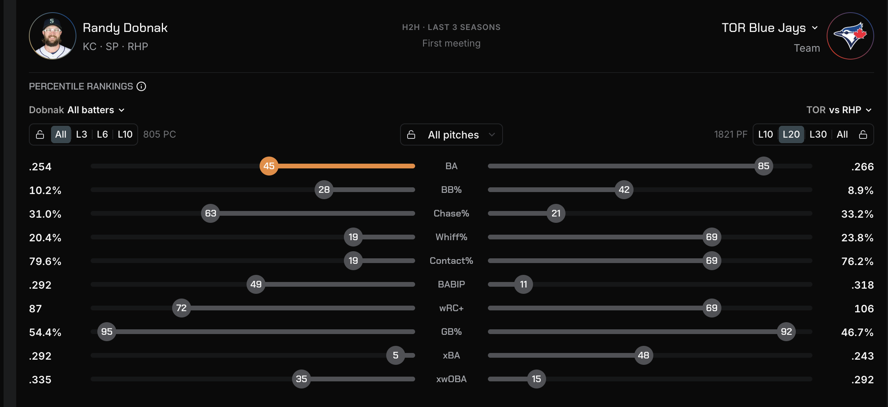
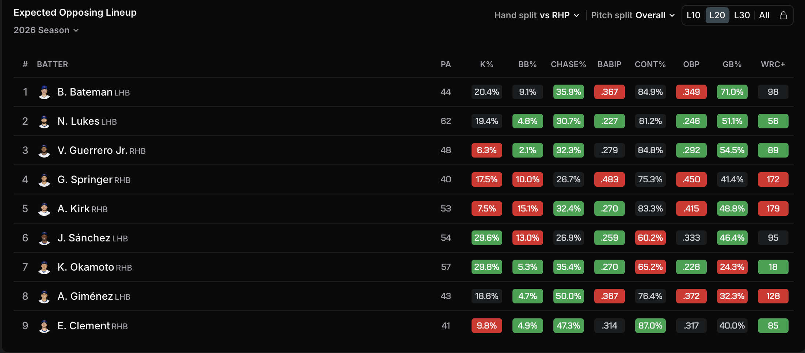

**Claude:** Best-supported pick on the slate, and it got the smallest stake.

**But the stated mechanism is wrong on both legs.**

"Chicago's walk rate" — Toronto's. Their BB% vs RHP is 8.9%, **42nd percentile**. Guerrero walks 2.1%, Giménez 4.7%, Clement 4.9%, Okamoto 5.3%, Lukes 4.8%. Chase is 33.2%. Aggressive, ball-in-play lineup — the opposite of what the thesis needs.

"Early hook highly probable" — he isn't getting hooked. 92, 93, 98, 88, 91, 90, 93 in his last eight. On Aug 20 he threw ~93 pitches for **12 outs**.

**The real argument is efficiency.** 92.6 pitches for 15.2 outs — **6.1 pitches per out**, worse than deGrom's 5.9. To reach 17 outs inside ~92 pitches he needs 5.4, managed in 3 of 9 starts. Those three are exactly his three overs.

**The 1.58 ERA is fiction.** xBA .292 at the **5th percentile**, K-BB% 4.6%, whiff and contact both 19th percentile. Surviving on a 95th-percentile ground-ball rate.

**Price, third time.** Header -120, agents -117, screenshot **-136**.

Base rate 66.7% under; haircut to 60–63%.

---

**Andy:** thanks -- you can ignore the prices in the predictions fwiw

**Claude:** That collapses a chunk of what I flagged. Two things survive:

The screenshot prices don't match the headers either. Gore +141 vs +116; Dobnak -120 vs -136. Could be line movement, worth confirming.

And the Cynic still reasons about price explicitly. If those numbers are unreliable, that agent's conviction is partly built on a fake input.

---

**Andy:** -128 is the price on dobnak

**Claude:** Breakeven 56.1%. Against 60–63% that's 4–7 points of edge — a real play.

Rough Kelly at 61% and -128 is ~11% of bankroll, far more than anyone should fire on one prop. Quarter-Kelly is 2–3%, and 0.2u at $10 implies ~$2,000 bankroll, so $50–60 rather than $10.

The sizing logic is the thing to fix. Dobnak scored 8/7/6 — the only pick with real dispersion — and got a quarter of what Gore's unanimous 9/9/9 got. If the agents are downstream of shared capper input, dispersion is closer to a signal of independent thought than consensus is.

---

**Andy:** royals bullpen btw

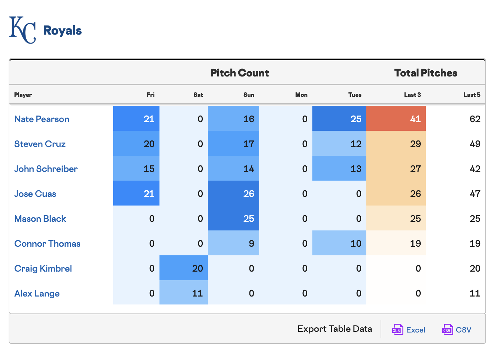

**Claude:** Pushes the under further.

Three arms threw Tuesday — Pearson 25, Schreiber 13, Cruz 12 — with no off day since. Pearson is at 41 over three and 62 over five. Available: Kimbrel and Lange (last worked Saturday), plus Thomas at 19.

What's thin is the **bridge**. Normally that argues over. But Dobnak's under case never depended on an early hook — he's already been left in for 92, 93, 98. A manager protecting bridge arms pushes him toward *more* pitches, and at his efficiency more pitches still doesn't reach 17 outs.

**62–64%.**

Third slate where bullpen state was decision-relevant and absent from all three agents.
---

## Aug 26 — Dodgers / Braves

**Andy:** thanks, here's all the LAD/ATL info

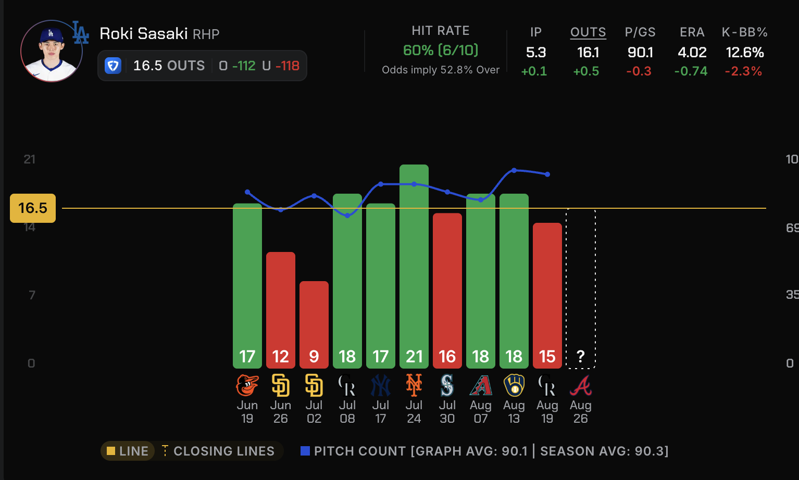
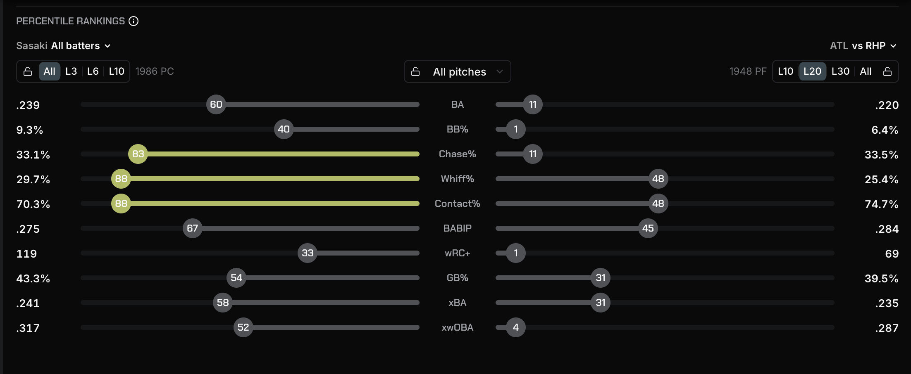
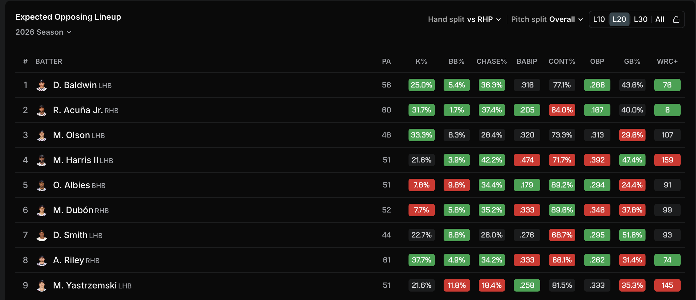
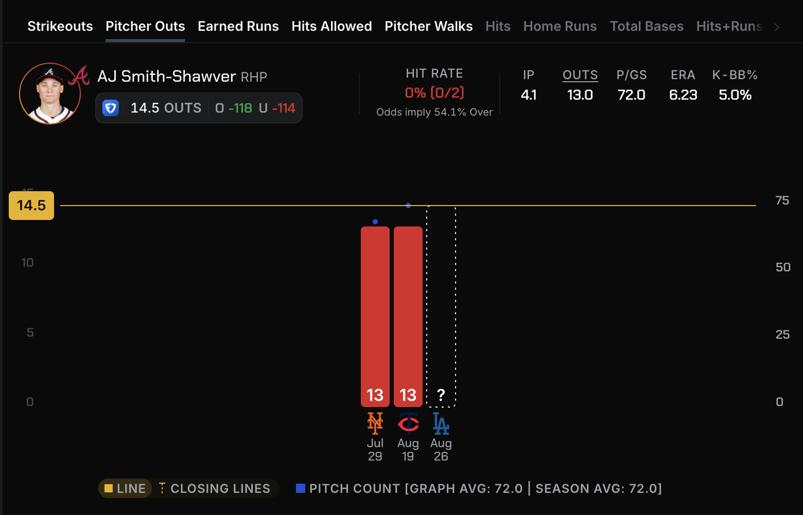
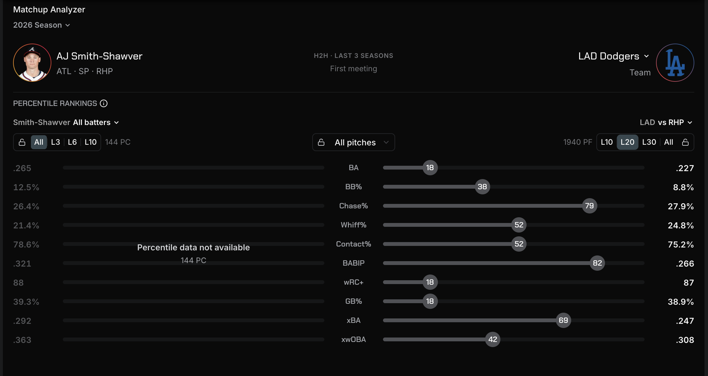
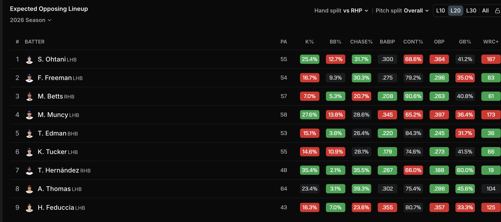
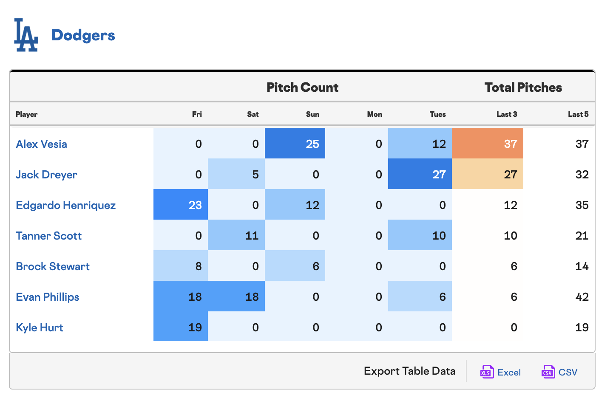
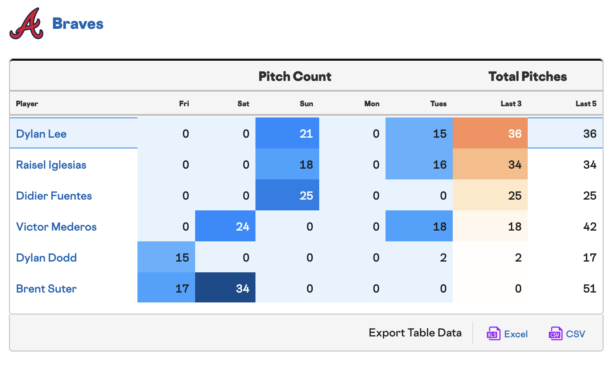

**Claude:** Supports a Dodgers lean, but not for the stated reasons.

**The strongest input is absent from all three writeups.** Atlanta vs RHP L20: **69 wRC+, 1st percentile**, .287 xwOBA at the 4th, 6.4% walk rate at the 1st. Acuña at a 6 wRC+ over 60 PA.

**Second-strongest is the bullpen mismatch.** Smith-Shawver averages 72 pitches for 13 outs — a 4.1-inning starter. Atlanta needs ~five innings of relief, and Lee (36 over three days), Iglesias (34), and Mederos all threw Tuesday. Dodd, with 2 pitches Tuesday, is the fresh arm.

**What caps it: the Dodgers can't hit either.** L20 vs RHP is an **87 wRC+, 18th percentile**, .227 BA, .308 xwOBA. Behind Ohtani (167) and Muncy (173): Betts 61, Freeman 63, Tucker 66, Edman 36, Hernández 19.

**Sasaki is good, not elite.** 88th percentile whiff and contact, 83rd chase — but 4.02 ERA, 12.6% K-BB, 9.3% BB at the 40th percentile.

**42–45% against a 44.6% breakeven.** Fair to a shade negative.

If the thesis is really about Sasaki, his outs prop at 16.5 is a cleaner expression than a runline depending on Betts and Freeman waking up.

---

**Andy:** you mean the under in outs

**Claude:** No, I meant the over — but I stated it badly. I wrote "60% hit rate and a 16.1 average" as if both supported the same side.

The over has hit 6 of 10. But his average is 16.1, *below* 16.5, because two short starts (9 and 12) drag the mean while the median sits at 17.

Breakeven at -112 is 52.8%, base rate 60%. **55–58%.**

---

**Andy:** no worries -- I was looking at the full season, where he's only 45% over

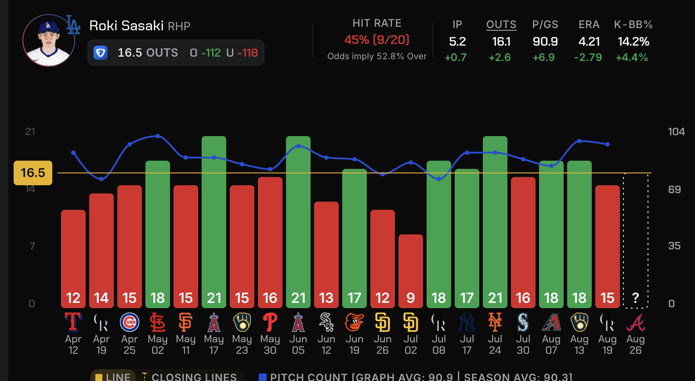

**Claude:** That kills the over. 9 of 20 is 45% against 52.8%. The 6-of-10 was the last ten starts.

Which means the under is the side with the edge, not the over. I had it backwards.

What's odd is the splits all read as improvement: outs +2.6, IP +0.7, P/GS +6.9, K-BB +4.4%. The four sub-14-out starts are all April through July 2; since July 8 he's gone 18, 17, 21, 16, 18, 18, 15.

---

**Andy:** eh i mean the bots are seeing the same available data, and I know they aren't looking at propsmadness (what Im sending you). I don't think the recency is *nothing*

**Claude:** Agreed, and I overcorrected. Pitch count going from ~84 to ~91 is a role change, not variance.

The two windows aren't in conflict so much as measuring different pitchers. Sasaki in April–June was a ~14-out starter; since July 8 he's a ~17.6-out starter. The 45% season figure is dragged by a version of him that no longer exists.

**Over is live again — 55–58% after haircutting the 5-of-7.**

---

**Andy:** how does atl do in terms of running up pitch counts?

**Claude:** Poorly — the best pitch-count matchup on the slate.

**Team L20 vs RHP:** 6.4% walk rate at the **1st percentile**, 33.5% chase at the 11th. Contact 74.7% at the 48th — they're not fouling pitches off, they're swinging at bad ones.

Sub-6% walk rates from Baldwin (5.4), Acuña (1.7), Harris (3.9), Riley (4.9), Dubón (5.8), Smith (6.8). Albies at 7.8% K / 89.2% contact and Dubón at 7.7% / 89.6% are classic quick-inning profiles. Only Yastrzemski (11.8% BB, 18.4% chase) is patient, hitting ninth.

**Why it matters:** Sasaki's 9.3% walk rate is the specific weakness that shortens his starts, and this lineup won't exploit it.

**58–61% against 52.8%.**

Third time a lineup's walk rate has been the deciding variable — Milwaukee (bot said high, was low), Toronto (bot said high, was 42nd percentile), Atlanta (1st percentile, unmentioned).

---

## Aug 26 — Red Sox / Marlins

**Andy:** thanks, bet roki's over! here's the sox/marlins pitcher matchup

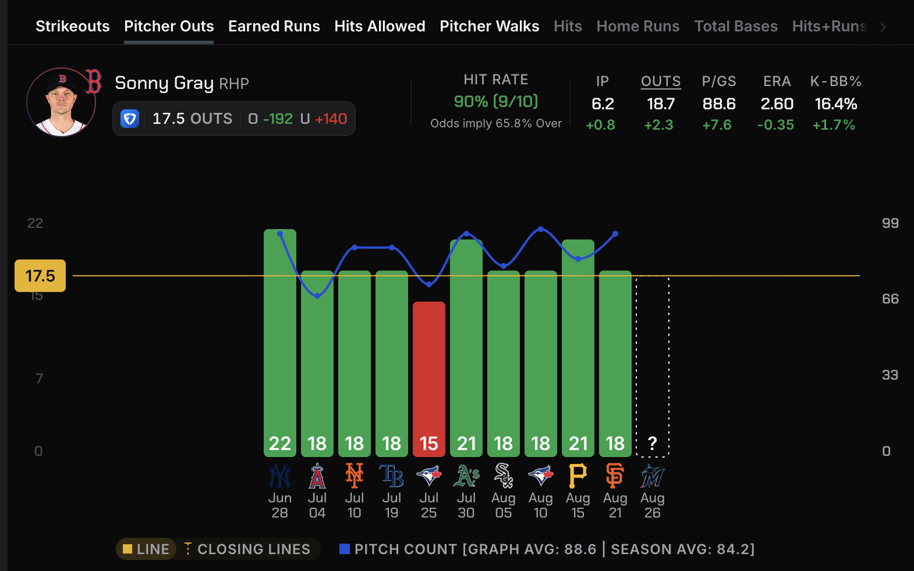
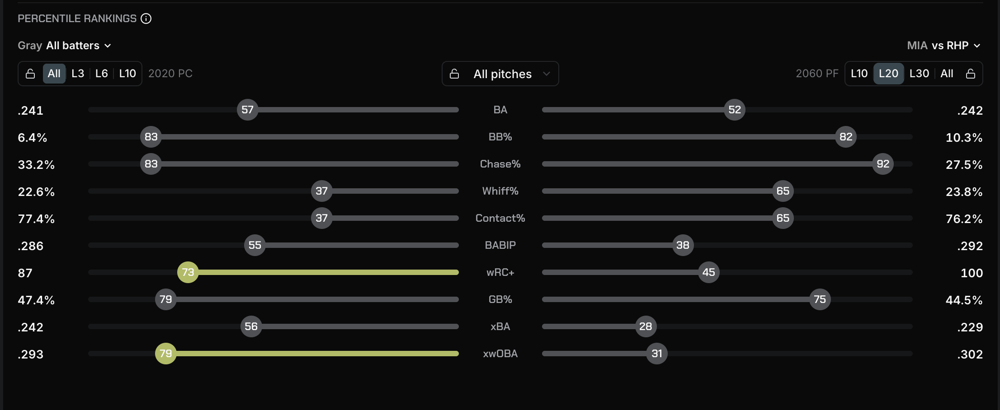
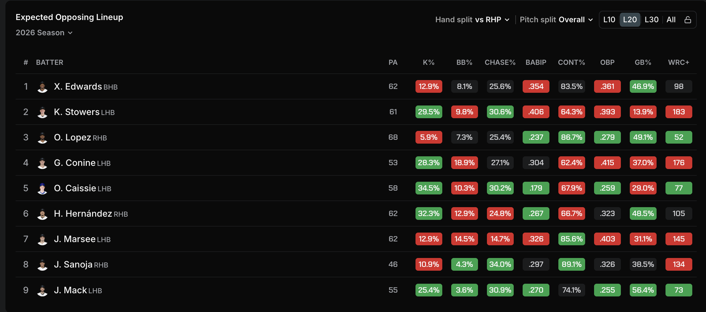
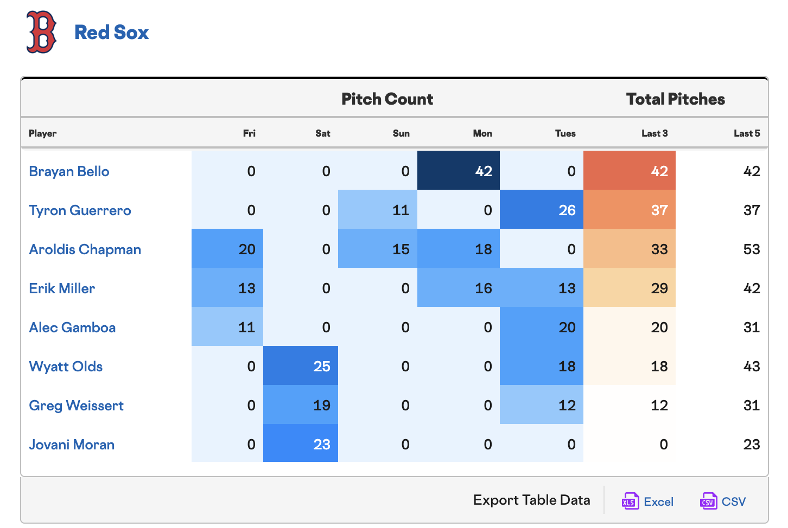
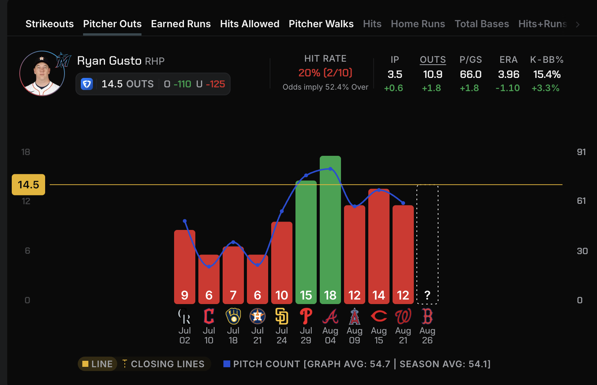
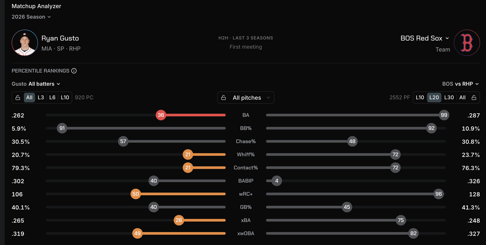
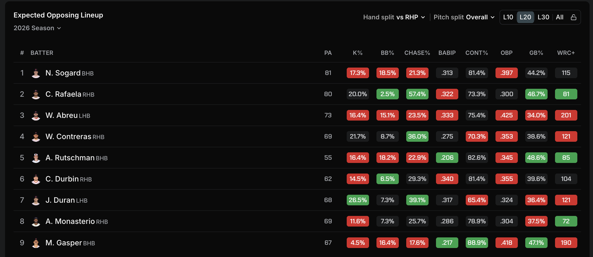
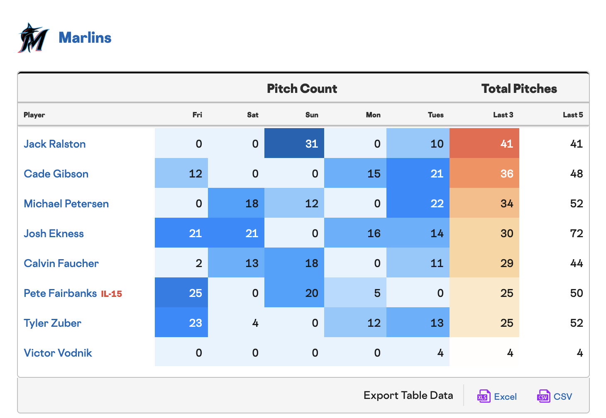

**Claude:** This game's best bet probably isn't the one the bot played.

**"Gusto can't go deep" is a massive understatement:** **10.9 outs on 66 pitches.** A 3.2-inning starter. Miami needs ~six innings of relief every time out.

**And their bullpen is wrecked.** Fairbanks on the IL. Ralston, Gibson, Petersen, Ekness, Faucher, and Zuber *all* threw Tuesday. Ekness has 72 pitches across four appearances in five days. Vodnik's 4 pitches make him the only fresh arm.

**Boston's offense exploits it** — 128 wRC+ at the 96th percentile vs RHP, 10.9% walk rate at the 92nd, with Sogard (18.5% BB), Abreu (15.1%, .425 OBP), Rutschman (18.2%), Gasper (16.4%, .418 OBP).

**Two pullbacks.** Boston's .326 BABIP is 4th percentile against a .248 xBA. And their own pen is worn — Chapman 53 pitches over five days.

**"Marlins offense in decline" is wrong.** 100 wRC+, 45th percentile, 10.3% walk rate at the 82nd, 27.5% chase at the **92nd**. Disciplined, not fading.

**Runline: 41–44% against 44.8%.** Fair to marginally negative.

**The better bet is Gray's outs over 17.5.** **4.74 pitches per out**, the most efficient starter on either slate, 9 of 10 clearing. Six of ten are *exactly* 18 outs — a manager with a firm six-inning plan. Graph average 88.6 vs season 84.2 says he's been stretched out. **75–80% against 65.8%.**

---

**Andy:** thanks -- yeah i don't take anything over -150

**Claude:** Reasonable — the ruin math on heavy favorites is unforgiving.

That leaves the runline as the only way to express the Miami-bullpen thesis, and I have it slightly negative.

Board: Dobnak, Sasaki, Gore, Red Sox -1.5, Cubs/ARI over 8.5.

Every edge I found came from pitch efficiency, opponent walk/chase rates in the correct hand split, or bullpen fatigue. None are features the bot appears to use.

---

**Andy:** ... and -130 is really where my wall is. anything beyond that has to be really good.

**Claude:** Then Dobnak at -128 is right at the wall. My 62–64% rests on a nine-start sample and a read that 6.1 pitches per out is a stable trait. If it drifts to -135, don't chase.

Your wall also quietly kills a chunk of what the bot surfaces — both LOCKs and both runlines cluster in the -110 to -125 band. Worth applying the filter *before* the agents score anything. It also pushes toward plus-money underdogs, where the bot's outcome-trend reasoning is weakest.

---

## Aug 26 — Cubs / Diamondbacks

**Andy:** cubs dbacks data. btw ive been giving you last 20 hitter data, do you think whole season would be better?

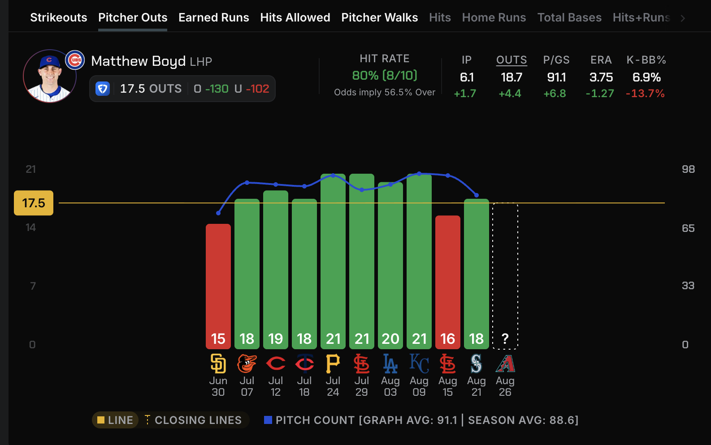
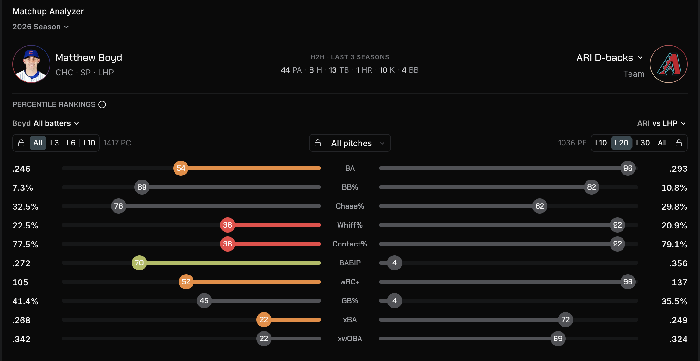
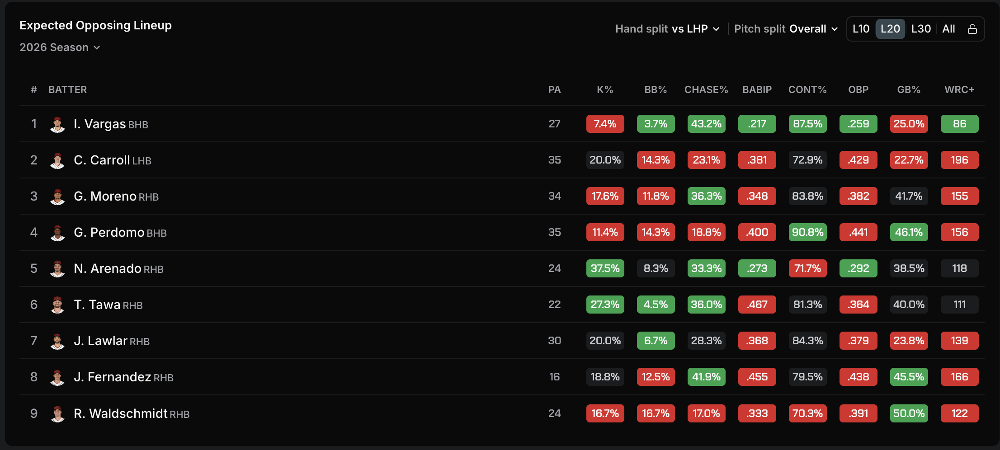
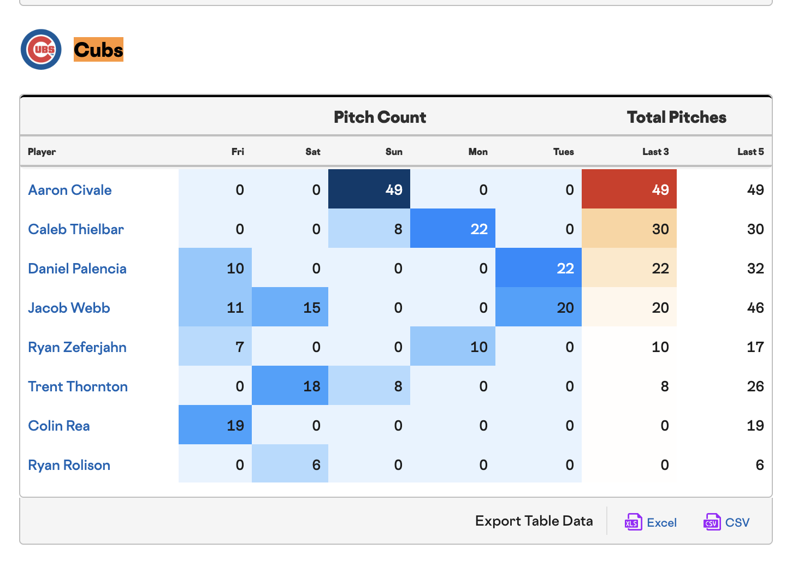
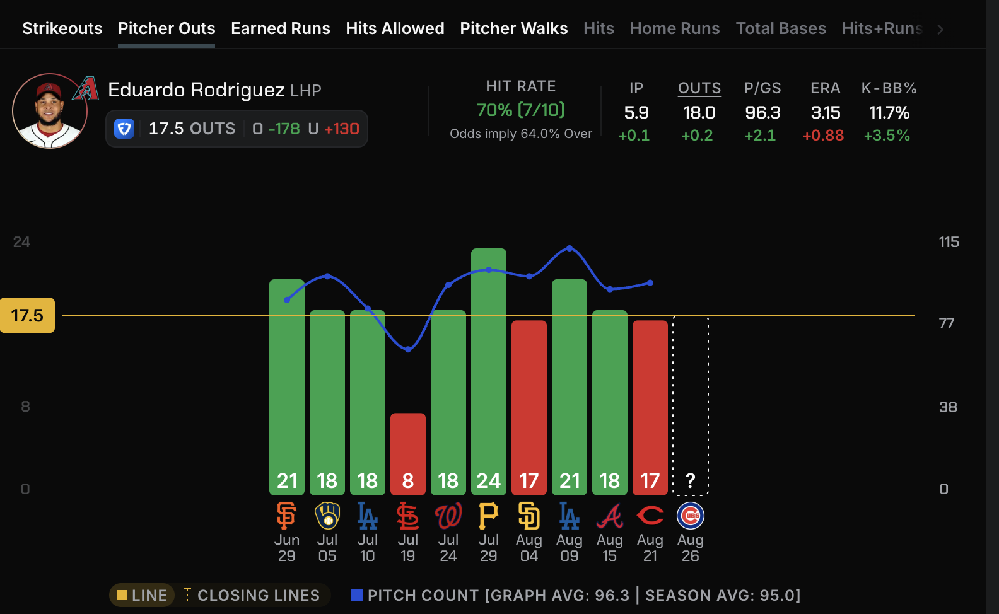
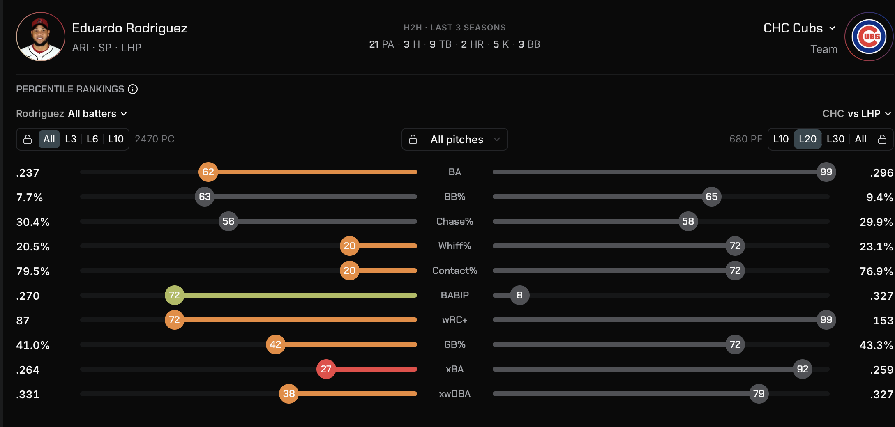
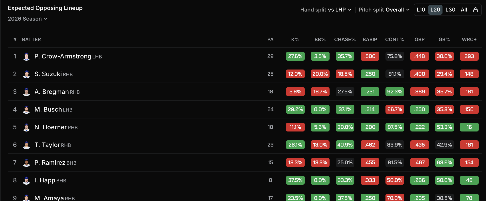
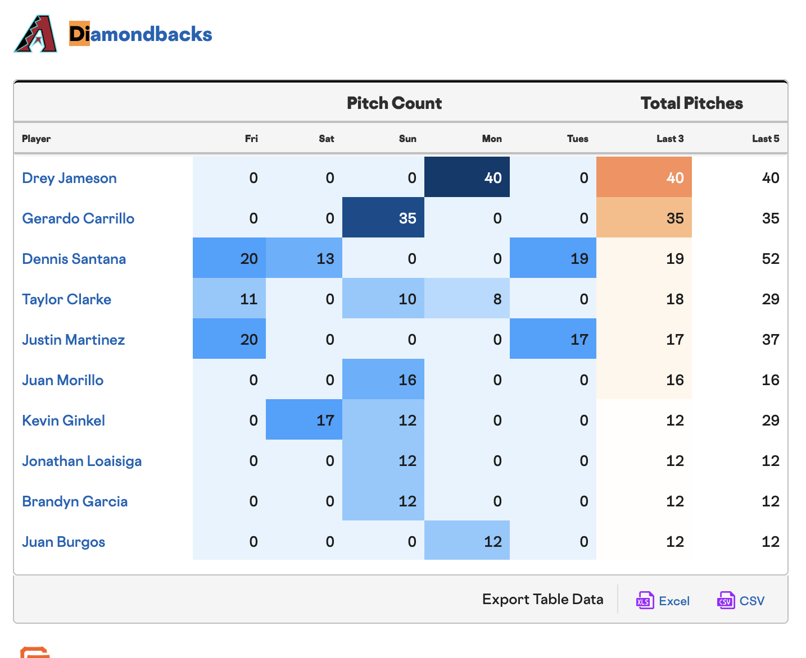

**Claude:** **It depends on the column, and that explains a lot.**

Plate discipline — K%, BB%, chase%, contact% — stabilizes in roughly 60–200 PA. Outcome stats — BABIP, BA, wRC+ — need 500–800+. The pitches-faced counts here are 1036 and 680, roughly 265 and 175 team PA, or 20–35 per lineup spot.

So discipline columns are marginal but usable; outcome columns are noise. Crow-Armstrong's .500 BABIP and 293 wRC+ over 29 PA aren't information.

That's uncomfortable for me — I've cited L20 wRC+ several times today. Those are shakier than I made them sound.

**Recommendation: season as default for hand splits, L20 only as a change detector.**

**Which is exactly what's happening here.** Arizona vs LHP is 96th percentile in BA and wRC+; the Cubs are 99th. That's where "both lineups rank top-2 vs LHP" comes from. Both are running on BABIPs at the 4th and 8th percentile — Arizona .293 BA vs .249 xBA, Chicago .296 vs .259. Hot, not good.

**The over case that holds is the pitchers' peripherals.** Boyd's .342 xwOBA allowed is 22nd percentile against a 3.75 ERA, K-BB% collapsed to 6.9%. E-Rod at .331 xwOBA, 38th percentile, against 3.15.

**But both go deep and both pens are rested.** ~12 innings from starters, six for relief, nobody forced into a bad matchup.

**Roughly 8.4–8.8 expected runs. 50–53% against 54.5%. Pass.**

**The better bet is Boyd's outs over 17.5 at -130** — 8 of 10, misses are 15 and 16, 4.87 pitches per out.

---

**Andy:** more boyd data, the depth is a recent development

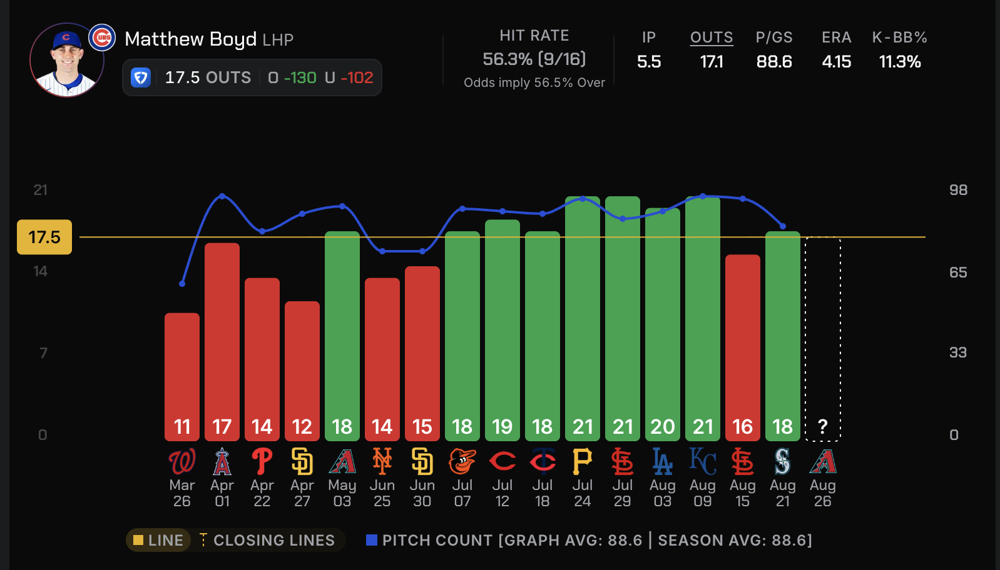

**Claude:** Same shape as Sasaki — third time today the L10 and season disagree because of a role change.

Season is 9 of 16, 56.3%, against a 56.5% breakeven. Dead fair. But the split is clean: March–June 30 he went 11, 17, 14, 12, 18, 14, 15 — one over in seven. From July 7: 18, 19, 18, 21, 21, 20, 21, 16, 18 — eight of nine. Average moves from ~14.4 to ~19.1.

Pitch count tracks it — mid-60s to mid-70s early, mid-80s to low-90s from July 7. Same signature as Sasaki's +6.9 P/GS.

**66–70% against 56.5%.** Best play available under -130.

Caution: Arizona's 10.8% walk rate is the one trait that threatens a pitch-efficient starter, and Boyd's 6.9% K-BB means he's not missing bats to escape jams.

Three cases in one day where a mid-season role change made the season hit rate misleading. Argues for a changepoint check on P/GS rather than a fixed window.

---

**Andy:** "Both teams hit lefties well, neither bullpen is strong, and the series has already produced a 7-0 and 5-4 game."

**Claude:** Two of three don't survive.

**"Both teams hit lefties well"** — L20 window, BABIP-driven. Same claim shape as "Milwaukee ranks 1st vs LHP."

**"Neither bullpen is strong"** — strength isn't the variable, availability is, and both pens are rested. The pens only need ~six innings because Boyd and E-Rod average 19.1 and 18.0 outs.

**"7-0 and 5-4"** — 7-0 is a blowout, not an over. And 5-4 stays under 8.5.

---

**Andy:** 5-4 doesn't stay under ... and a blowout is only about one side. it says one team can put up 7 runs. the other team would only need to put up 2.

**Claude:** Both land. 5+4 is 9, which is over 8.5 — I read the total as 5 with a 4 attached. And 7-0 is a lineup demonstrating it can put up 7; the shutout is a separate event, not a cap.

So the honest version: two games, one clearing the number. Not evidence against the way I said.

What doesn't change is the pitching side. **52–55% against 54.5%** — a coin flip rather than a pass, but not enough to bet.

---

**Andy:** just realized you are only getting bullpen rest, not quality ... chc and ari in order here

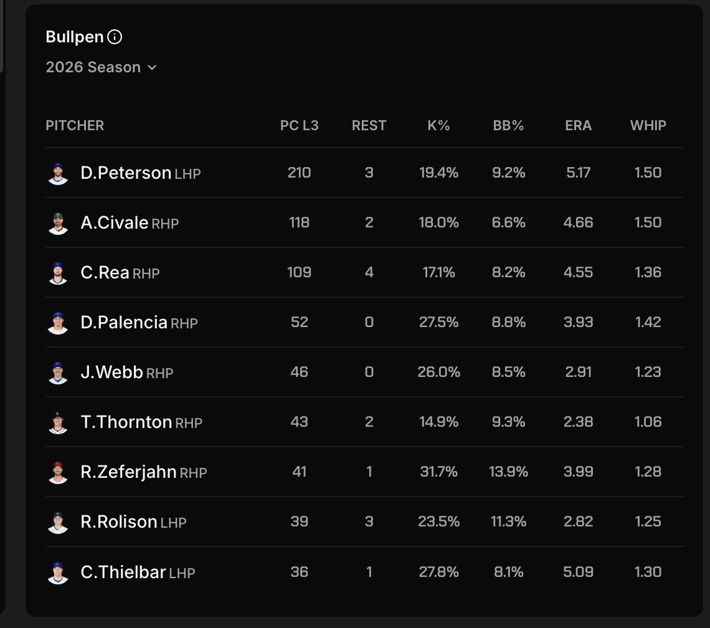
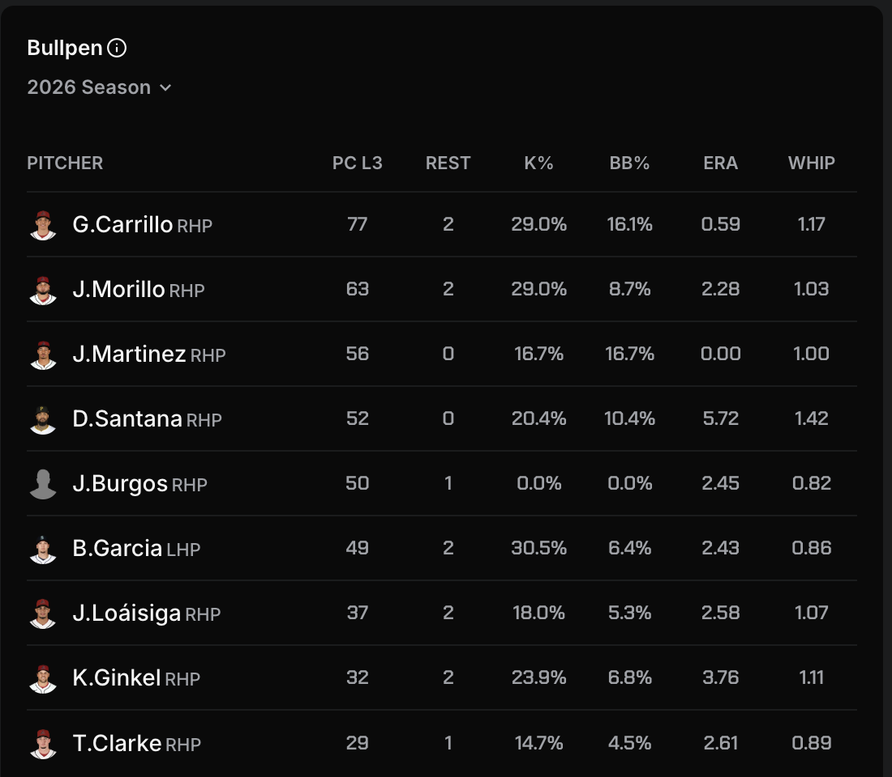

**Claude:** Splits the two pens in a way raw rest hid.

**Arizona's is better than "not strong."** Loaisiga 2.58, Garcia 2.43, Ginkel 3.76, Clarke 2.61, Morillo 2.28, Burgos 2.45 — six arms under 4.00, all rested. Carrillo's 0.59 comes with a 16.1% walk rate.

**Chicago's is where the over case lives.** Peterson 5.17, Thielbar 5.09, Civale 4.66, Rea 4.55. The good arms are Webb (2.91), Thornton (2.38), Rolison (2.82) — but Thornton's 14.9% K rate means no bat-missing, and Zeferjahn's 13.9% BB generates traffic.

**53–56% now against 54.5%.** Still not a bet.

**It firms up Boyd's over.** A manager whose middle relief is Civale, Rea, Peterson, and Thielbar has every incentive to squeeze the extra inning out.

Pen quality plus rest is strictly better than either alone.

---

**Andy:** i can get the boyd over at -127 ... might just bet both a little

**Claude:** Boyd at -127 is clean — 55.9% breakeven against 66–70%.

The total at 53–56% against 54.5% is a coin flip where I can't tell you which side of breakeven it's on. My estimate moved three times across three rounds of new information; the error bars are wider than the gap.

Also: Boyd going deep is mildly *bad* for the over. If you're playing both, you're partially hedging.

---

**Andy:** the over is at -110 now btw

**Claude:** Breakeven drops to 52.4%, my range is 53–56% — now on the right side of the line. Thin but positive. At -110 you're not paying for the uncertainty; at -120 you were.
---

## Aug 26 — Gore line correction

**Andy:** so i can get gore for 6 ks at -120

**Claude:** Different line, not just a different price — 6.5 to 6.0 means 6 K pushes instead of losing.

Recomputed: 7 overs, 3 pushes, 5 unders. Excluding pushes, 7-of-12 = 58.3% against 54.5%. Push equity does real work at a line sitting on his 6.4 average.

**56–59% adjusted.**

---

**Andy:** sorry -- this is 6+ ks, not a line of 6.0

**Claude:** Then no pushes — 6 K wins. Effectively over 5.5.

From the log (5, 6, 10, 6, 5, 7, 7, 4, 7, 5, 9, 4, 9, 5, 7): **10 of 15 clear 6.** 66.7% against 54.5%.

Much bigger edge, because his distribution clusters at 5–7. The misses are 5, 5, 4, 4, 5. Moving the line down one strikeout converts three 6s from losses to wins and drops the bar to ~20 batters faced instead of 23.

**61–64% after adjusting for the contact bats at the top of Chicago's order.**

| Bet | Estimate | Breakeven |
|---|---|---|
| Boyd over 17.5 @ -127 | 66–70% | 55.9% |
| Gore 6+ K @ -120 | 61–64% | 54.5% |
| Sasaki over 16.5 @ -112 | 58–61% | 52.8% |
| Dobnak under 16.5 @ -128 | 62–64% | 56.1% |
| Cubs/ARI over 8.5 @ -110 | 53–56% | 52.4% |

All four real plays came from either a line shopped or a stat the bot didn't use.

---

## Aug 26 — Landen Roupp under 17.5 outs

**Andy:** landon roup under 17.5 outs, thoughts? (gave you whole season for batters now)

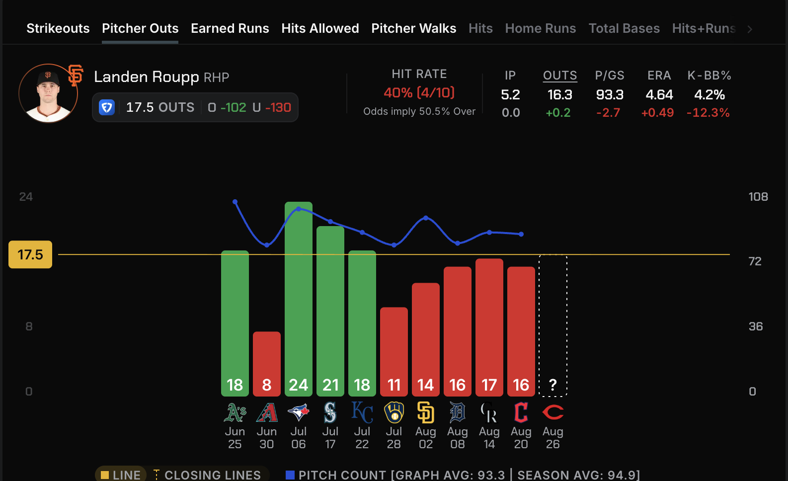
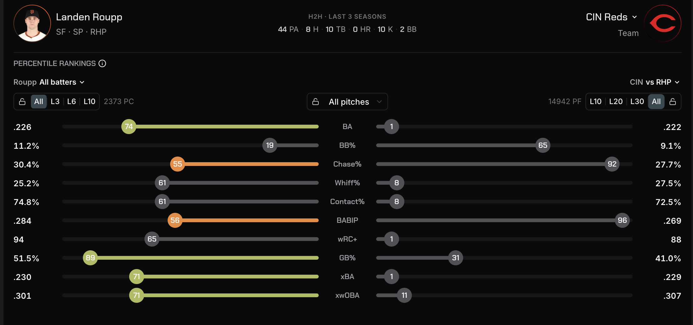
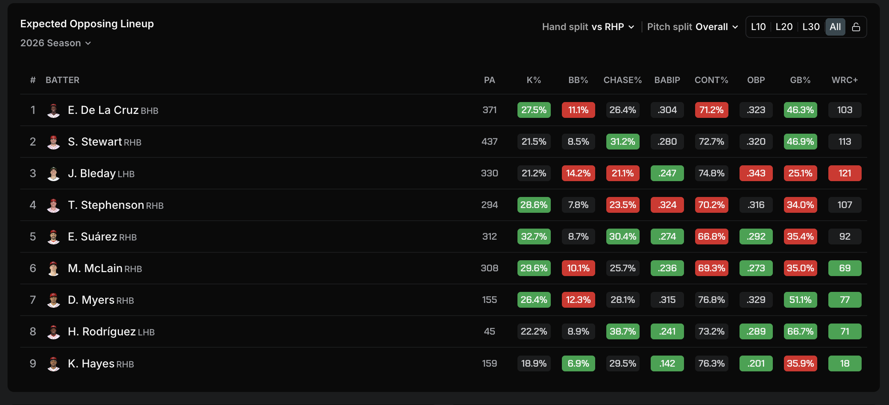
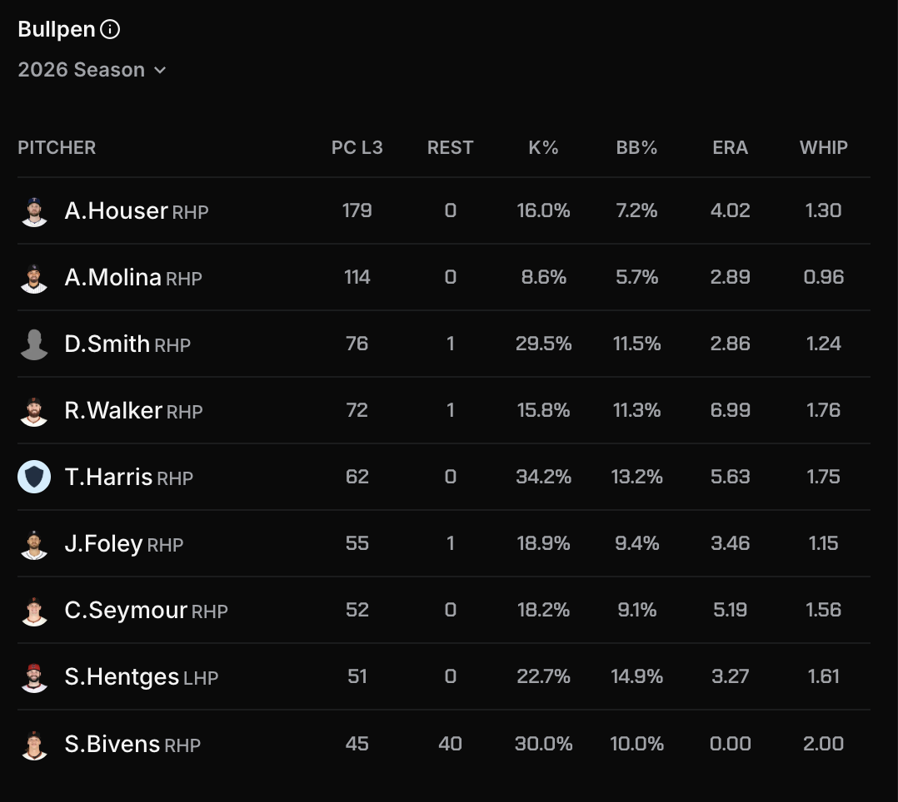
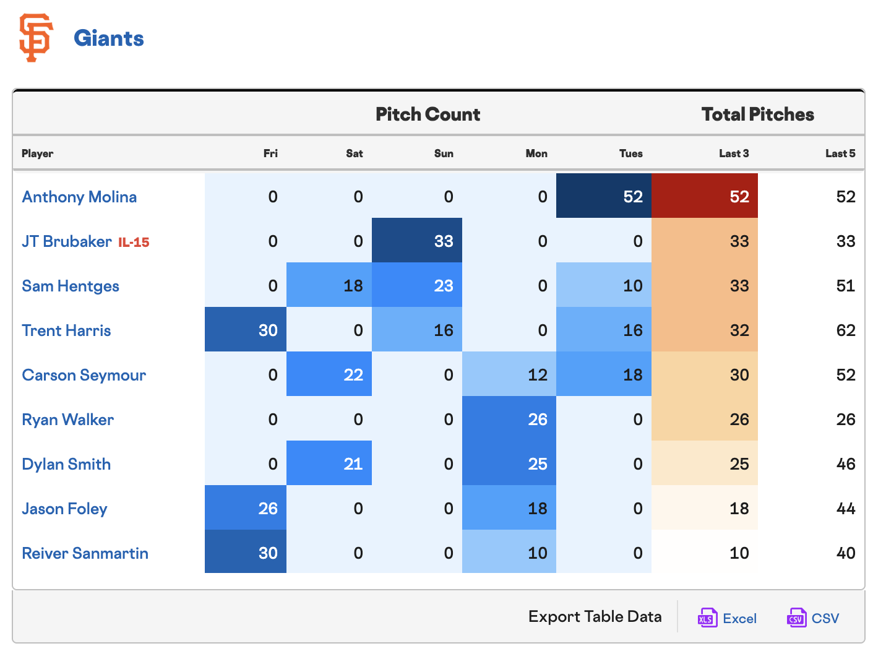

**Claude:** Under is right, and season-long batter data helps — 155–437 PA samples instead of 27–35.

**The mechanism is efficiency, same as Dobnak.** 93.3 pitches for 16.3 outs = **5.72 per out**. At his season-average 94.9 pitches that projects to 16.6 outs. Reaching 18 requires ~103 pitches.

**Cincinnati punishes him specifically.** Bad offense — 88 wRC+ and .229 xBA both 1st percentile — but expensive: 27.5% whiff at the 8th percentile, 27.7% chase at the **92nd**, 9.1% walk rate at the 65th. De La Cruz, Bleday, McLain, Myers all walk over 10%; five of nine at 26%+ K.

Against a pitcher walking **11.2% at the 19th percentile** with a **4.2% K-BB**, that compounds. His 51.5% ground-ball rate is his one efficiency lever, and the Reds hit grounders 41% of the time — 31st percentile. The lever doesn't engage.

**Trend is one-directional.** First five: 18, 8, 24, 21, 18. Last five: 11, 14, 16, 17, 16 — zero overs, average 14.8. Pitch counts held ~90 throughout: efficiency decay, not a shorter leash.

**Giants pen doesn't flip it.** Molina 52 Tuesday; Harris, Seymour, Hentges, Houser all at zero rest. Available: Smith (2.86), Foley (3.46), Walker (6.99). Manager wants length — but at 5.7–6.1 per out, even 100 pitches lands at 16–17.

**62–66% against 56.5%.**

Caveat: this is the L10 view. Boyd's L10 said 80% and his season said 56.3%; Sasaki's L10 said 60% and season said 45%. Pull the season chart.

---

**Andy:** whole season. he's lost it recently, or his leash has gotten shorter.

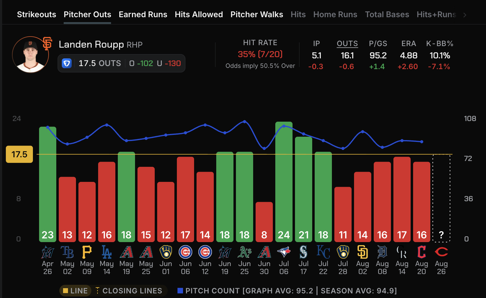

**Claude:** Season data makes the under stronger — first time the full window has done that today.

**Season base rate is 65% under** (13 of 20). The over hit early — 23 on Apr 26, then 18, 17, 18, 18, 24, 21, 18 scattered through May–July — and has vanished since Jul 22: 11, 14, 16, 17, 16.

**It's skill, not leash, and the pitch counts say so.** P/GS went *up* recently (95.2 graph vs 94.9 season, +1.4 on the split). Aug 08 and Aug 20: ~90–93 pitches for 16 outs. Jul 06: 24 outs on about 100. Same workload, eight fewer outs.

**Peripherals confirm.** K-BB% is 10.1% on the season but **4.2% recently, down 7.1**. ERA up 2.60. Walking 11.2% at the 19th percentile.

**66–70% against 56.5%** — strongest under in two days.

Opposite pattern from Boyd and Sasaki. Those were role changes that made the recent window *more* informative. This is decay in the same direction as the season number. Exactly what a changepoint check on P/GS would catch: Boyd's pitch count jumped, Roupp's didn't.

---

## Final card

**Andy:** here's today's card

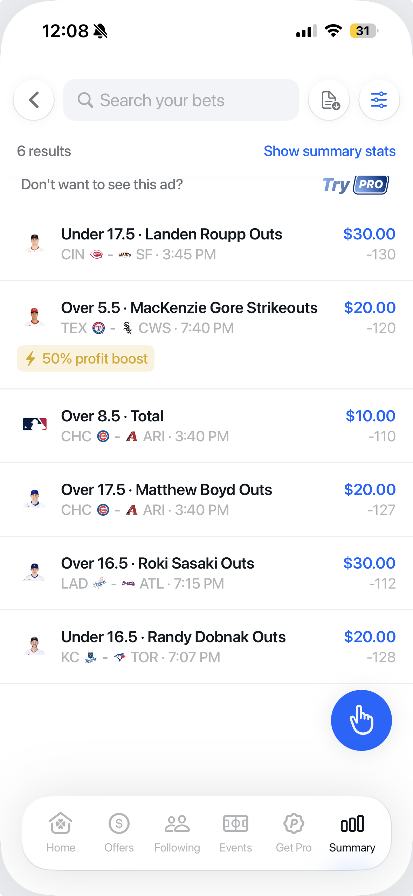

| Bet | Price | Stake |
|---|---|---|
| Under 17.5 · Landen Roupp Outs (CIN-SF) | -130 | $30 |
| Over 5.5 · MacKenzie Gore Strikeouts (TEX-CWS) — *50% profit boost* | -120 | $20 |
| Over 8.5 · Total (CHC-ARI) | -110 | $10 |
| Over 17.5 · Matthew Boyd Outs (CHC-ARI) | -127 | $20 |
| Over 16.5 · Roki Sasaki Outs (LAD-ATL) | -112 | $30 |
| Under 16.5 · Randy Dobnak Outs (KC-TOR) | -128 | $20 |

**Claude:** Six bets, $130, sizing roughly right relative to the edges. Better-shaped than yesterday's.

**The Gore boost is a real edge bump.** 50% profit boost on -120 pays ~1.25x instead of 0.83x, dropping effective breakeven from 54.5% to roughly 44%. Against 61–64% that's the biggest edge on the card, with the second-smallest stake.

**Roupp at -130** is exactly at the wall — no room if it drifts.

**Boyd and the total are the correlated pair.** $20 and $10, smaller on the leg that partly works against the larger. Reasonable.

Five of six came from a shopped line, a window correction, or a stat the bot didn't use. Track results against *that* comparison rather than win-loss — a six-bet night tells you almost nothing on its own.

---

## Recurring findings

### Errors in the bot's output

1. **Price fields don't match the bet.** Header, agent reasoning, and screenshot disagreed on nearly every pick across both slates. On Gore this was the difference between a clear play and a pass.
2. **Rolling-window opponent splits reported as season league ranks.** Milwaukee "1st vs LHP" (was in the 80–90 wRC+ cluster), Toronto's walk rate "6th" (42nd percentile), "both lineups top-2 vs LHP" (L20 BABIP artifacts).
3. **Circular consensus.** Agents cite each other's agreement as evidence while all summarizing the same capper input. Careful explicitly upgraded a score because Quant and Cynic agreed.
4. **Sizing anti-correlated with edge.** Unanimous 9/9/9 picks got 1.2u; the only pick with real dispersion (8/7/6) got 0.2u.
5. **Rate stats cited without usage.** Gore's changeup K-rate on a pitch he may barely throw.
6. **Soft stats as pillars.** Pitcher W-L record, split ERAs on small samples.

### Features that generated every edge found

- **Pitch efficiency (pitches per out).** Gray 4.74, Boyd 4.87, deGrom 5.9, Roupp 5.72, Dobnak 6.1. The single most predictive input for outs props.
- **Opponent BB% and chase% in the correct hand split.** Decided Milwaukee, Toronto, Atlanta, Cincinnati.
- **Bullpen quality *and* rest together.** Rest alone misled on the Rangers; quality alone would have missed Miami.
- **Expected stats on both pitcher and offense.** xBA/xwOBA caught deGrom's .374 BABIP, Dobnak's 5th-percentile xBA, and both hot L20 lineups in Cubs/ARI.
- **Changepoint detection on P/GS.** Distinguishes role change (Boyd, Sasaki — weight recent) from skill decay (Roupp — both windows agree).

### Sample-size guidance

Plate discipline stabilizes in ~60–200 PA and is usable at L20. Outcome stats (BABIP, BA, wRC+) need 500–800+ and are noise at L20. Use season for hand splits; use L20 only as a change detector.

### Corrections made during the session

- Overstated the "5.2 IP" notation issue as a comprehension error when it was a display artifact.
- Invented an injury explanation for deGrom's 6-out start to discount an inconvenient data point.
- Misstated deGrom's season outs average as 16.4 when it was 15.0.
- Named the wrong side on the Sasaki outs prop, then over-corrected against recency when the role change was real.
- Misread 5-4 as under 8.5, and treated a 7-0 blowout as evidence against an over.
- Cited L20 wRC+ figures several times before flagging that they're too noisy at that sample.
